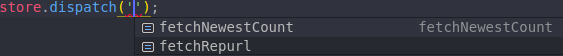
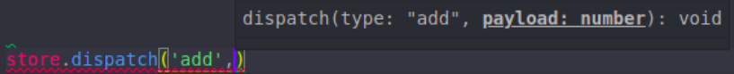
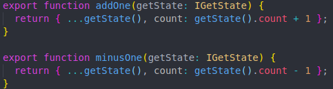

# 强类型的Redux状态管理

## redux存在的问题

**让我们先来看看裸写redux大致需要哪些步骤:**

在裸写redux时,需要维护以常量命名的action

``` js

const FOOACTION = 'FOOACTION'

```

然后再dispath

``` js

import FOOACTION from '...'

dispath({type: FOOACTION, payload: ''})

```

在reducer函数中以switch处理不同的action

``` js

import FOOACTION from '...'

function reducer(state, action) {
  switch(action.type) {
    case FOOACTION:
      return ...
  }
}

```

*以常量命名action可以使代码更加规范与约束,但也造成了大量的模板代码.*

*常量命名action只约束了action没有约束payload.*

*在reducer中以switch处理不同action写法太丑.*

## *type-redux*如何解决

1. 使用typescript的类型约束action



有哪些action一目了然,提高编码体验.

不用单独声明常量action也不怕action名打错.

2. 约束了不同的action的不同payload参数类型



再也不用担心payload类型传错.

3. 一个函数为一个action,函数名对应为action名



不用在reducer里面使用switch区分不同的action

## 快速开始

```
npm install type-redux
```

1. **initialState**

``` ts
const initialState = {
  count: 0
};

type IState = typeof initialState;
```

初始state值，并且获取其类型.

2. **reducer**

``` ts
function add(payload: number, state: IState) {
  return { ...state, count: state.count + payload };
}

function minus(payload: number, state: IState) {
  return { ...state, count: state.count - payload };
}

```

每个函数对应一个action,函数名为action的名.

每个函数返回state.

接受两个参数,第一个为payload,第二个为当前state.

3. **createStore**

``` js
const store = createStore({ add, minus }, initialState);
```

第一个参数为对象,key为reducer函数的名称,valu为函数.

第二个参数为初始值.

4. 使用

``` ts
// dispatch
store.dispatch('add', 1);
store.dispatch('minus', 2);

// 获取state
store.State
```

## 异步

需要使用到异步操作时,例如网络请求.

1. 声明函数async.

``` ts
async function foo(data: null, getState: () => IState) {
  await fetch('/xxx');
  return { ...getState() };
}
```

**第二个参数为得到state的方法.**

2. dispatchAsyc

``` ts
store.dispatchAsync('foo', null);
```

dispatchAsync方法的第一个参数为异步函数action的名称.

## 在React中使用

[type-redux-hook](https://github.com/whj1995/type-redux-hook)

## Example

[例子](https://github.com/whj1995/type-redux/blob/master/doc/index.ts)

[React例子](https://github.com/whj1995/type-redux-hook/tree/master/demo)